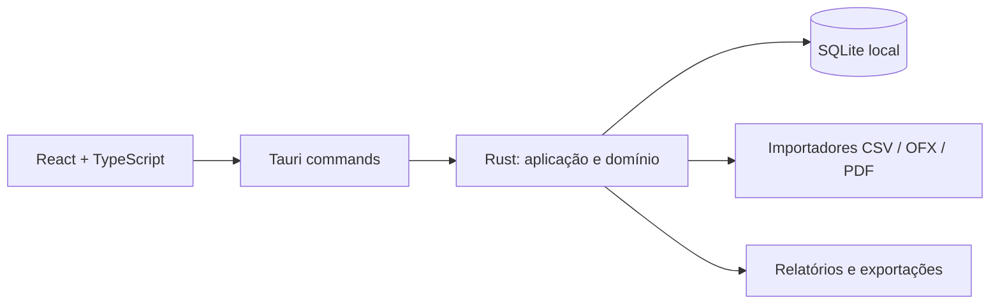

<div align="center">
  

  <h1>Lumen</h1>

  <p>
    <strong>Seu dinheiro, mais claro.</strong>
  </p>

  <p>
    Gestor financeiro pessoal, privado e local-first.
  </p>

  <p>
    <a href="https://github.com/filipeclacerda/lumen/actions"></a>
    <a href="https://github.com/filipeclacerda/lumen/releases"></a>
    <a href="LICENSE"></a>
    <a href="https://github.com/filipeclacerda/lumen/stargazers"></a>
  </p>

  <p>
    Controle suas finanças no computador sem conectar sua conta bancária e sem enviar seus dados para uma nuvem.
  </p>

  <p>
    <a href="#visão-geral">Visão geral</a> •
    <a href="#princípios-do-projeto">Princípios</a> •
    <a href="#funcionalidades">Funcionalidades</a> •
    <a href="#privacidade-e-segurança">Privacidade</a> •
    <a href="#como-executar">Como executar</a> •
    <a href="#contribuindo">Contribuindo</a>
  </p>
</div>

---

## Visão geral

O **Lumen** é um gestor financeiro pessoal para desktop criado para deixar seu dinheiro mais claro sem abrir mão de autonomia e privacidade.

Ele centraliza movimentações de contas e cartões, organiza categorias, importa extratos, acompanha recorrências, projeta orçamento mensal e gera relatórios para análise. A proposta é ajudar você a responder perguntas simples e importantes:

- Para onde meu dinheiro foi neste mês?
- Quanto sobrou depois de gastos e investimentos?
- Quais categorias ou estabelecimentos mais pesam no orçamento?
- Que lançamentos futuros ou recorrentes merecem atenção?
- Meus dados financeiros continuam sob meu controle?

Você não precisa conectar uma conta bancária nem enviar extratos para uma nuvem. O Lumen segue uma abordagem **local-first**: os dados são armazenados em um banco SQLite no próprio computador e a aplicação foi desenhada para funcionar sem depender de servidores externos para processar suas informações financeiras.

> O Lumen não substitui aconselhamento financeiro profissional. Ele é uma ferramenta de organização, análise e acompanhamento pessoal.

---

## Princípios do projeto

### Privacidade por padrão

Dados financeiros são sensíveis. Por isso, o Lumen evita login obrigatório, sincronização forçada e processamento em servidores de terceiros. Importações, categorizações, relatórios e backups acontecem localmente.

### Open source de verdade

O Lumen é um projeto **100% open source**, distribuído sob a licença MIT. Isso significa que qualquer pessoa pode estudar o código, auditar o funcionamento, abrir issues, propor melhorias, criar forks e contribuir com o desenvolvimento.

A transparência não é um detalhe secundário: ela faz parte da confiança que o projeto quer construir.

### Controle nas mãos do usuário

O objetivo é que você saiba onde seus dados estão, consiga exportar suas informações e tenha liberdade para adaptar o app ao seu fluxo. O projeto prioriza formatos abertos, backup local e uma arquitetura simples de inspecionar.

### Experiência desktop moderna

Construído com Tauri, Rust, React e TypeScript, o Lumen busca entregar uma aplicação leve, rápida e confortável para uso recorrente, com interface nativa, tema claro/escuro e navegação fluida.

---

## Status do projeto

O Lumen está em desenvolvimento ativo. A base principal já inclui importação, transações, categorias, cartões, orçamento, relatórios, recorrências, backup e exportação, mas o produto ainda evolui rapidamente.

Antes de usar com dados financeiros críticos:

- mantenha backups atualizados;
- revise prévias de importação antes de confirmar lançamentos;
- acompanhe o [CHANGELOG](CHANGELOG.md) para entender mudanças entre versões;
- considere que criptografia nativa do banco local ainda está no roadmap.

---

## Funcionalidades

| Área                       | O que o Lumen oferece                                                                                                                                    |
| -------------------------- | -------------------------------------------------------------------------------------------------------------------------------------------------------- |
| **Visão geral**            | Dashboard mensal com receitas, despesas, investimentos, sobra do mês, fluxo de caixa, próximos vencimentos e indicadores de saúde financeira.            |
| **Transações**             | Listagem pesquisável, filtros por período, conta, categoria, status, origem e valor; criação, edição, exclusão com restauração e categorização em massa. |
| **Importação**             | Suporte a OFX, CSV bancário, CSV de cartão, layouts personalizados, perfis de mapeamento, templates oficiais e PDFs textuais de extrato do Sicoob.       |
| **Cartões de crédito**     | Cadastro de cartões, importação de faturas, itens por fatura, estornos, pagamentos e vínculo entre pagamento bancário e fatura.                          |
| **Contas**                 | Cadastro e organização de contas correntes, poupança, dinheiro e cartões de crédito.                                                                     |
| **Categorias e regras**    | Categorias hierárquicas por tipo de movimento, cores, ícones, regras automáticas por texto, valor, conta, tipo e expressão regular.                      |
| **Sugestões inteligentes** | Categorização por regras explícitas e sugestão por histórico de estabelecimentos, sempre processadas localmente.                                         |
| **Orçamento**              | Limites mensais por categoria, acompanhamento do gasto, valor disponível, projeção do mês e alerta de status.                                            |
| **Recorrências**           | Cadastro de receitas e despesas fixas, geração de pendências mensais e controle de recorrências ativas ou pausadas.                                      |
| **Relatórios**             | Evolução mensal, distribuição por categoria, origem dos gastos, principais estabelecimentos, metas, tendências e alertas financeiros.                    |
| **Exportação**             | Exportação de transações em CSV, OFX e PDF, além de relatórios financeiros em PDF.                                                                       |
| **Backup e restauração**   | Cópia local do banco SQLite, restauração validada e opção de reinicialização dos dados.                                                                  |
| **Usabilidade**            | Tema claro/escuro, comando rápido com `Ctrl+K`, navegação por mês e interface preparada para uso diário.                                                 |

---

## Privacidade e segurança

O Lumen foi desenhado para reduzir exposição desnecessária de informações financeiras.

- O banco principal é um arquivo SQLite local (`financa.db`).
- O frontend não acessa o banco diretamente; operações passam por comandos nativos do Tauri.
- Arquivos importados são lidos para gerar prévias e confirmar lançamentos no próprio computador.
- Backups são arquivos locais escolhidos pelo usuário.
- Não há conta online obrigatória, assinatura ou coleta silenciosa de dados financeiros pelo projeto.

### Verificação dos artefatos de release

Os instaladores e pacotes de atualização gerados pelo workflow de release recebem uma attestation de proveniência do GitHub. Depois de baixar um artefato, verifique se ele foi produzido por este repositório:

```bash
gh attestation verify CAMINHO_DO_ARTEFATO --repo filipeclacerda/lumen
```

A verificação exige o [GitHub CLI](https://cli.github.com/). Releases anteriores à adoção das attestations podem não possuir esse registro. A attestation comprova a origem do build, mas não substitui a assinatura do updater nem garante, isoladamente, que o artefato seja seguro.

### Nota importante sobre criptografia

O banco local ainda não é criptografado pela própria aplicação. Até que a criptografia nativa seja implementada, recomenda-se proteger o computador com recursos do sistema operacional, como senha forte, disco criptografado e backups guardados em local seguro.

Itens como SQLCipher, Windows Credential Manager/DPAPI e melhorias adicionais de proteção local fazem parte das prioridades de segurança do roadmap.

---

## Arquitetura

O projeto separa a interface, a camada nativa e o domínio financeiro para manter o código mais auditável e evolutivo.



### Stack principal

- **Tauri 2** para empacotamento desktop leve.
- **Rust** para comandos nativos, regras de domínio, importação e persistência.
- **SQLite + SQLx** para banco local e migrations.
- **React 19 + TypeScript** para a interface.
- **TanStack Query** para estado assíncrono.
- **React Router** para navegação.
- **Recharts** para gráficos.
- **Vite, Vitest e ESLint** para desenvolvimento, testes e qualidade.

### Estrutura do repositório

```text
.
├── src/                     # Frontend React/TypeScript
│   ├── app/                 # Shell principal e rotas
│   ├── features/            # Telas por domínio: dashboard, transações, importação etc.
│   └── shared/              # API, tipos, formatação e componentes compartilhados
├── src-tauri/               # Aplicação Tauri/Rust
│   ├── src/                 # Comandos, domínio, infraestrutura e estado da aplicação
│   ├── migrations/          # Evolução do banco SQLite
│   └── icons/               # Ícones e assets nativos
├── docs/adr/                # Decisões arquiteturais
├── CHANGELOG.md             # Histórico de versões
├── CONTRIBUTING.md          # Guia de contribuição
└── LICENSE                  # Licença MIT
```

---

## Como executar

### Pré-requisitos

Instale antes de começar:

- [Node.js 22+](https://nodejs.org/)
- [Rust](https://www.rust-lang.org/tools/install)
- [Git](https://git-scm.com/)
- Dependências nativas do [Tauri](https://tauri.app/)

No Windows, também é necessário ter o ambiente MSVC configurado, normalmente por meio do Visual Studio Build Tools com suporte a desenvolvimento desktop em C++.

### Instalação local

```bash
git clone https://github.com/filipeclacerda/lumen.git
cd lumen
npm install
```

### Desenvolvimento

```bash
npm run tauri dev
```

Esse comando inicia o Vite e abre a aplicação desktop via Tauri.

### Testes e qualidade

```bash
# Testes do frontend
npm test

# Build do frontend
npm run build

# Lint do frontend
npm run lint

# Testes do backend Rust
cargo test --manifest-path src-tauri/Cargo.toml
```

### Build desktop

```bash
npm run tauri build
```

Os artefatos de instalação são gerados pela pipeline do Tauri em `src-tauri/target/release/bundle`.

---

## Scripts úteis

| Comando                                           | Descrição                                               |
| ------------------------------------------------- | ------------------------------------------------------- |
| `npm run dev`                                     | Inicia apenas o servidor Vite.                          |
| `npm run tauri dev`                               | Executa a aplicação desktop em modo de desenvolvimento. |
| `npm test`                                        | Roda os testes do frontend com Vitest.                  |
| `npm run build`                                   | Compila TypeScript e gera o build web.                  |
| `npm run lint`                                    | Executa ESLint no projeto.                              |
| `npm run tauri build`                             | Gera o build desktop empacotado.                        |
| `cargo test --manifest-path src-tauri/Cargo.toml` | Roda os testes Rust.                                    |

---

## Roadmap

Algumas frentes importantes para as próximas evoluções:

- criptografia nativa do banco local;
- integração com mecanismos seguros do sistema operacional para proteção de chaves;
- melhorias de acessibilidade;
- refinamento do instalador e do processo de atualização;
- importadores adicionais e layouts bancários mais ricos;
- evolução dos relatórios e indicadores de planejamento;
- cobertura de testes ampliada para fluxos críticos;
- melhorias contínuas de performance e experiência de uso.

Sugestões de roadmap são bem-vindas em issues e discussions.

---

## Contribuindo

Contribuições são muito bem-vindas. O Lumen é **open source por escolha de produto e de comunidade**: melhorias no código, documentação, design, acessibilidade, testes, importadores, correções de bugs e ideias de UX ajudam o projeto a ficar mais útil para todos.

Antes de contribuir, leia:

- [CONTRIBUTING.md](CONTRIBUTING.md)
- [CODE_OF_CONDUCT.md](CODE_OF_CONDUCT.md)
- [CHANGELOG.md](CHANGELOG.md)

Fluxo básico:

```bash
git checkout -b feature/minha-melhoria
# faça suas alterações
npm test
cargo test --manifest-path src-tauri/Cargo.toml
git commit -m "feat: descreve minha melhoria"
git push origin feature/minha-melhoria
```

Depois, abra um Pull Request explicando o problema, a solução e como testar.

### Boas práticas para issues

- Não publique extratos reais, dados bancários, documentos ou informações pessoais.
- Ao reportar bugs de importação, anonimize exemplos antes de anexar.
- Inclua versão do app, sistema operacional e passos de reprodução quando possível.
- Para propostas grandes, abra uma issue primeiro para alinhar escopo.

---

## Licença

O Lumen é um projeto **open source** licenciado sob os termos da licença MIT.

Consulte [LICENSE](LICENSE) para o texto completo.

---

<div align="center">
  <p>
    Feito para quem quer entender melhor o próprio dinheiro sem abrir mão de privacidade, autonomia e transparência.
  </p>
</div>
